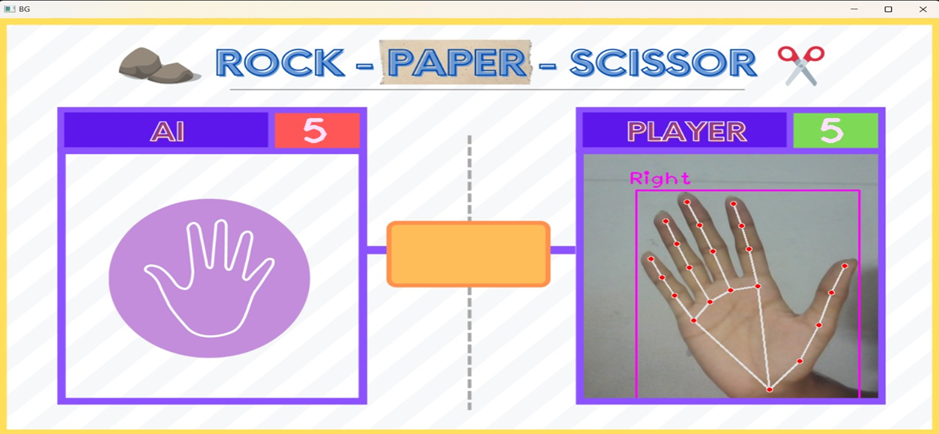

# 🎮 Raspberry Pi Hand Gesture Recognition

AI-based Rock-Paper-Scissors game using OpenCV, MediaPipe, and TensorFlow Lite.

## 📸 Demo

## ✊✋✌ Gestures

| Rock | Paper | Scissors |
|------|------|----------|
|  |  |  |

## 🚀 Features

- Real-time hand gesture detection  
- Rock, Paper, Scissors game logic  
- AI vs Player gameplay  
- Live webcam processing  
- Works on Raspberry Pi

  
  ## 🧠 How It Works

1. Captures live video using webcam  
2. Detects hand landmarks using MediaPipe  
3. Identifies gesture based on finger positions  
4. Generates random AI move  
5. Compares moves and displays result  
 

## 📦 Libraries Used

- OpenCV – real-time image processing and video capture  
- MediaPipe – hand landmark detection  
- NumPy – numerical operations  
- cvzone – simplified computer vision utilities  
- TensorFlow Lite – lightweight model deployment (optional)

## ▶️ How to Run

pip install opencv-python mediapipe cvzone numpy
python main.py

## 📂 Project Structure
assets/ # Images and UI assets
│── rock.png
│── paper.png
│── scissor.png
│── ui.png
│── result1.png
│── result2.png
│── result3.png
│── workflow.png

main.py # Main game logic
HandTrackingModule.py # Hand detection module
requirements.txt # Dependencies
README.md # Project documentation

## 🖥️ Output Screenshots

## 🔮 Future Improvements

- Add GUI interface  
- Improve accuracy using deep learning  
- Add voice control  
- Deploy on robotic system  

## 👨‍💻 Author

Bandhan Kumar Das  
B.Tech CSE (IoT)

